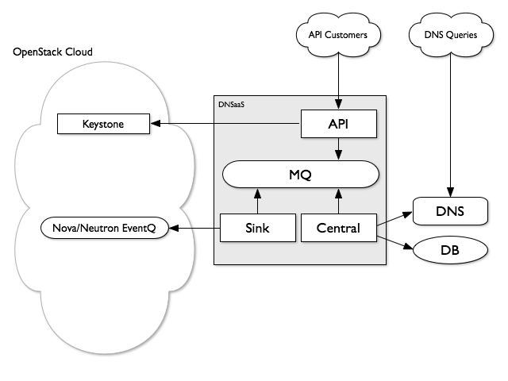

..
    Copyright 2012 Endre Karlson for Bouvet ASA

    Licensed under the Apache License, Version 2.0 (the "License"); you may
    not use this file except in compliance with the License. You may obtain
    a copy of the License at

        http://www.apache.org/licenses/LICENSE-2.0

    Unless required by applicable law or agreed to in writing, software
    distributed under the License is distributed on an "AS IS" BASIS, WITHOUT
    WARRANTIES OR CONDITIONS OF ANY KIND, either express or implied. See the
    License for the specific language governing permissions and limitations
    under the License.

============
Architecture
============

.. index::
    double: architecture; brief

High Level Topology
-----------------------

.. _designate-api:

Designate API
-----------------------
designate-api provides the standard OpenStack style REST api service, accepting http requests, validating authentication tokens with Keystone & passing them to the :ref:`designate-central` service over AMQP. Multiple versions of the api can be hosted, as well as api-extensions, allowing for pluggable extensions to the core api.

Although designate-api is capable of handling https traffic, it's typical to terminate https elsewhere, e.g. by placing nginx infront of designate-api or by letting the the external facing load balancers terminate https.

.. _designate-central:

Designate Central
-----------------------
designate-central is the service that handles RPC requests via the MQ, it coordinates the persistant storage of data & manipulating backend DNS servers via backends or agents.  storage is provided via plugins, typically SQLAlchemy, although MongoDB or other storage drivers should be possible.

.. _designate-sink:

Designate Sink
-----------------------
designate-sink is an optional service which listens for event notifications, such as compute.instance.create.end, handlers are available for Nova and Neutron. Notification events can then be used to trigger record creation & deletion.

The current sink implementations generate simple forward lookup A records, using a format specified in :ref:`handler-nova` configuration.  Any field in the event notification can be used to generate a record.

.. _dns-backend:

DNS Backend
-----------------------
backends are drivers for a particular DNS server.
Designate supports multiple backend implementations, PowerDNS, BIND, MySQL BIND and dnsmasq, you are also free to implement your own backend to fit your needs, as well as extensions to provide extra functionality to complement existing backends.

.. _designate-agent:

Designate Agent
-----------------------
designate-agents are optional components that interact with DNS servers.  Agents are alternatives to backend plugins in :ref:`designate-central`. Agents communicate with :ref:`designate-central` via the :ref:`message-queue`.

.. _message-queue:

Message Queue
-----------------------
Designate uses oslo.rpc for messaging between components, therefore it inherits a requirement for a supported messaging bus (RabbitMQ, Qpid, ZeroMQ etc).  Typically this means a RabbitMQ setup is dedicated to Designate, but as only a single virtualhost is required for a normal installation, you’re free to use other RabbitMQ instances as you see fit.

.. _database:

Database/Storage
-----------------------
storage drivers are drivers for a particular SQL/NoSQL server, designate needs a SQLAlchemy supported storage engine for the persistent storage of data, the recommended driver is MySQL.
