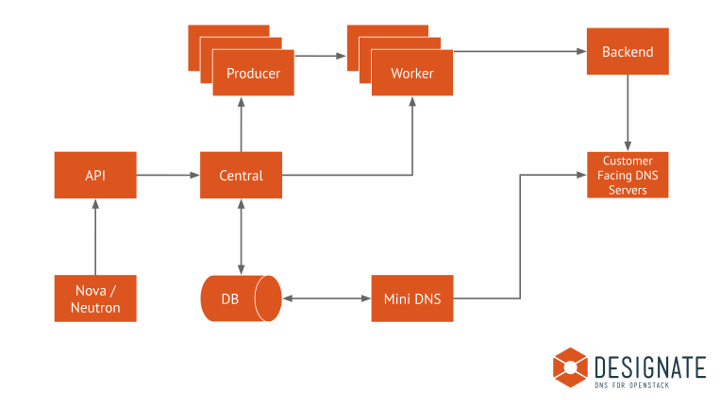

..
    Copyright 2012 Endre Karlson for Bouvet ASA

    Licensed under the Apache License, Version 2.0 (the "License"); you may
    not use this file except in compliance with the License. You may obtain
    a copy of the License at

        http://www.apache.org/licenses/LICENSE-2.0

    Unless required by applicable law or agreed to in writing, software
    distributed under the License is distributed on an "AS IS" BASIS, WITHOUT
    WARRANTIES OR CONDITIONS OF ANY KIND, either express or implied. See the
    License for the specific language governing permissions and limitations
    under the License.

.. _architecture:

============
Architecture
============

Designate provides multi-tenant DNS as a Service. Designate provides
a REST API, applies business logic, persists DNS data to a database,
and orchestrates the propagation of the DNS data to configured pools
of DNS servers. For a more detailed breakdown of responsibilities
and components, see the components below.

.. index::
    double: architecture; brief

High Level Topology
-------------------

.. _designate-api:

Designate API
-------------
designate-api provides the standard OpenStack style REST API service,
accepting HTTP requests, validating authentication tokens with Keystone and
passing them to the :ref:`designate-central` service over AMQP.
Multiple versions of the API can be hosted, as well as API extensions,
allowing for pluggable extensions to the core API.

Although designate-api is capable of handling HTTPS traffic,
it's typical to terminate HTTPS elsewhere, for example by placing nginx
in front of designate-api or by letting the external facing load balancers
terminate HTTPS.

.. _designate-central:

Designate Central
-----------------
designate-central is the service that handles RPC requests via the MQ,
it coordinates the persistent storage of data and applies business logic
to data from the API. Storage is provided via plugins, typically SQLAlchemy,
although MongoDB or other storage drivers should be possible.

.. _designate-mdns:

Designate MiniDNS
-----------------
designate-mdns is the service that sends DNS NOTIFY and answers
zone transfer (AXFR) requests. This allows Designate to integrate with
any DNS server that supports these very standard methods of communicating.
designate-mdns also encapsulates all other forms of DNS protocol
that Designate performs. For example, sending SOA queries to check
that a change is live.

.. _designate-worker:

Designate Worker
----------------
designate-worker is a service that manages state of the DNS servers
Designate manages, and any other long-running or otherwise complicated piece
of work. The worker reads configuration for DNS servers from
the Designate database, which is populated via the pools.yaml file.
These DNS server backends are loaded into the worker so it understands
how to create, update, and delete zones and recordsets on each DNS server.
The Worker is fully aware of DNS Server 'Pools',
so a single worker process can manage many pools of DNS servers.

.. _designate-producer:

Designate Producer
------------------
designate-producer is a service that handles the invocation of long-running
and potentially large jobs. Producer processes start work for an automatically
assigned shard of the zones Designate manages. Shards are allocated based on
the first three characters of the zone ID (a UUID field).
The number of shards under management of a single producer process is equal
to the total number of shards divided by the number of producer processes.
This means the more producer processes are started, the less work is created
at any one time.

The current implemented tasks in producer include emitting dns.zone.exists
events for Ceilometer, purging deleted zones from database,
polling secondary zones at their refresh intervals, generating delayed
NOTIFY transactions, and invoking a periodic recovery of
zones in an error state.

.. _designate-sink:

Designate Sink
--------------
designate-sink is an optional service which listens for event
:ref:`notifications`, such as compute.instance.create.end,
handlers are available for Nova and Neutron.
Notification events can then be used to trigger record creation & deletion.

The current sink implementations generate simple forward lookup A records,
using a format specified in handler-nova configuration.
Any field in the event notification can be used to generate a record.

.. _dns-backend:

DNS Backend
-----------
Backends are drivers for a particular DNS server.
Designate supports multiple backend implementations, PowerDNS, BIND, NSD,
DynECT, you are also free to implement your own backend to fit your needs,
as well as extensions to provide extra functionality to complement
existing backends.

.. _message-queue:

Message Queue
-------------
Designate uses oslo.rpc for messaging between components, therefore it
inherits a requirement for a supported messaging bus
(such as RabbitMQ, Qpid or ZeroMQ).  Typically this means a RabbitMQ
setup is dedicated to Designate, but as only a single virtualhost
is required for a normal installation, you're free to use other
RabbitMQ instances as you see fit.

.. _database:

Database/Storage
----------------
Storage drivers are drivers for a particular SQL/NoSQL server.
Designate needs a SQLAlchemy-supported storage engine for the persistent
storage of data. The recommended driver is MySQL.

