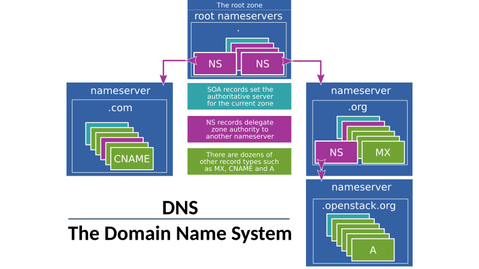
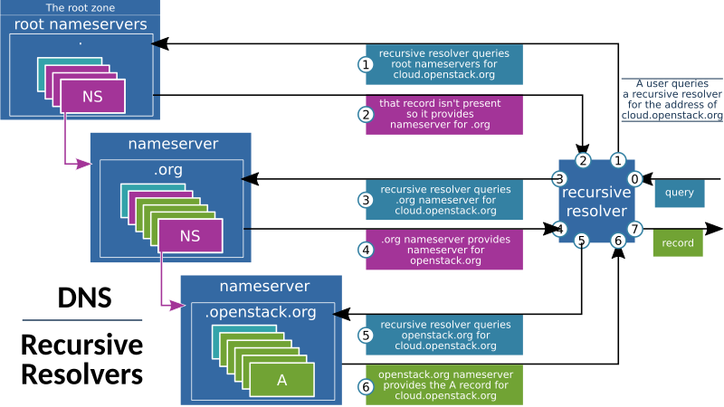
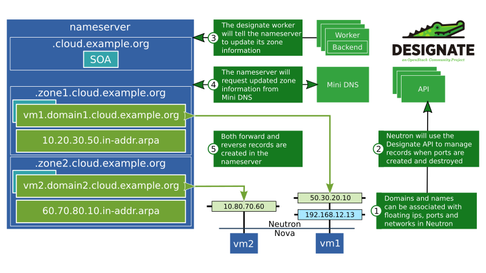

..
      Copyright 2020 OpenStack Foundation
      All Rights Reserved.

      Licensed under the Apache License, Version 2.0 (the "License"); you may
      not use this file except in compliance with the License. You may obtain
      a copy of the License at

          http://www.apache.org/licenses/LICENSE-2.0

      Unless required by applicable law or agreed to in writing, software
      distributed under the License is distributed on an "AS IS" BASIS, WITHOUT
      WARRANTIES OR CONDITIONS OF ANY KIND, either express or implied. See the
      License for the specific language governing permissions and limitations
      under the License.

.. _introduction:

=========================
Introduction to Designate
=========================

Designate is an Open Source DNS-as-a-Service implementation and a part of the
OpenStack ecosystem of services for running clouds. In order to understand what
Designate can do and how it works, it's necessary to understand some of the
basics of DNS.

.. index::
   double: introduction; brief

.. _what-is-dns:

What is DNS?
-----------------------------

The Domain Name System (DNS) is a system for naming resources connected to a
network, and works by storing various types of *record*, such as an IP address
associated with a domain name. In practice, this is implemented by
*authoritative name servers* which contain these records and *resolvers* which
query name servers for records. Names are divided up into a hierarchy of zones,
allowing different name servers to be responsible for separate groups of zones
by delegating responsibility using records.

The root zone, which is simply ".", is comprised entirely of records delegating
various top level domains (TLDs) to other nameservers. The TLD name servers
will contain records for domains within their TLD, such as the *.com*
nameserver having an *example.com* record, as well as records that delegate
zones to other nameservers, for example *openstack.org* might have their own
nameserver so that they can then create *cloud.openstack.org*.

|

|

*Resolvers* are often formed in two parts: a *stub* resolver which is often
merely a library on a  user's computer, and a *recursive resolver* that will
perform queries against nameservers before returning the result to the user.
When searching for a domain, the resolver will start at the end of the domain
and work its way back to the beginning.

For example in the diagram below, when searching for
cloud.openstack.org, it will start with the root nameserver ".", which will
reply with the location of the ".org" nameserver. The resolver can then contact
the ".org" nameserver to get the "openstack.org" nameserver and from there
finally get the "cloud.openstack.org" record and return it to the user.

|

|

In order to make this more efficient, the results are cached on the resolver,
so after the first user has requested "cloud.openstack.org", the resolver can
return the cached result for subsequent requests.

Further reading on DNS and how it works is available here:
  - https://en.wikipedia.org/wiki/Domain_Name_System

While the system itself is defined via RFCs such as this:
  - https://tools.ietf.org/html/rfc1034

.. _introducing-designate:

Introducing Designate
-----------------------------

Designate is an OpenStack service that allows users and operators to manage DNS
records, names and zones via a REST API and can configure existing DNS name
servers to contain those records. Designate can also be configured by an
operator to integrate with both the OpenStack Network Service (Neutron) and
the Compute Service (Nova) so that records are automatically created when
floating IPs and compute instances are created respectively, and uses the
OpenStack Identity Service (Keystone) for user management. Since there are a
multitude of software implementations of the DNS name server, Designate has a
pluggable backend that can be configured to manage many of them, most notably
BIND9 and PowerDNS.

.. _designate-architecture:

Designate Architecture
-----------------------------

Designate is comprised of several different services: the API, Producer,
Central, Worker and Mini DNS. It uses an oslo.db compatible database
to store state and data, and an oslo.messaging compatible message
queue to facilitate communication between services.
Multiple copies of all Designate services can be run in tandem to facilitate
high availability deployments, with the API process often sitting behind
load balancers.

|

.. image:: ../images/Designate-Arch.png
    :align: center
    :width: 800

|

Neutron and other users of Designate only need to be able to access the API
server, while administrators should ensure the DNS Nameservers to be
configured are able to access Mini DNS from which to request updates.

Below we can see a common deployment scenario:

A user has created two
zones in Designate: *zone1.cloud.openstack.org* and
*zone2.cloud.openstack.org*. This will result in two new zones
being created on the Designate-managed nameserver with SOA records.

The user then created two networks in Neutron: one private
network with *zone1.cloud.openstack.org* assigned to it, and one
public network with *zone2.cloud.openstack.org*.

They have then created virtual machine
*vm1* in Nova, connected to the private network in Neutron and attached
to a floating IP, and the virtual machine *vm2* attached directly to
the public network. Each of these actions triggers a chain of events
that will cause Neutron to request Designate create records on behalf
of the user, with the end result being that records are created in
the authoritative nameserver mapping the vm names to domains along
with PTR records to allow reverse lookups.

|

|

More information about configuring Neutron to work with Designate can be
found in the Neutron documentation at
https://docs.openstack.org/neutron/latest/admin/config-dns-int-ext-serv.html

.. _using-designate:

Using Designate
-----------------------------

Designate provides a REST API and that is commonly used by one of three
methods. The most common is to use the OpenStack client, a python command-line
tool with commands for interacting with OpenStack services. The documentation
for the OpenStack client is available at
https://docs.openstack.org/python-openstackclient/.
The
`designate plugin <https://docs.openstack.org/python-designateclient/latest/>`_
for the OpenStack client needs to be installed as well:

.. code-block:: console

   pip install python-openstackclient
   pip install python-designateclient

Another popular way to use Designate is via the OpenStack Dashboard, Horizon.
Administrators will need to add the
`Designate Horizon plugin <https://opendev.org/openstack/designate-dashboard>`_
to the dashboard in order to enable Designate features.

Finally, for python developers the aforementioned Designate plugin for
the OpenStack client which can be used as a python library. Other languages
may have bindings available from one of the third party
`SDKs <https://wiki.openstack.org/wiki/SDKs>`_ for OpenStack.
